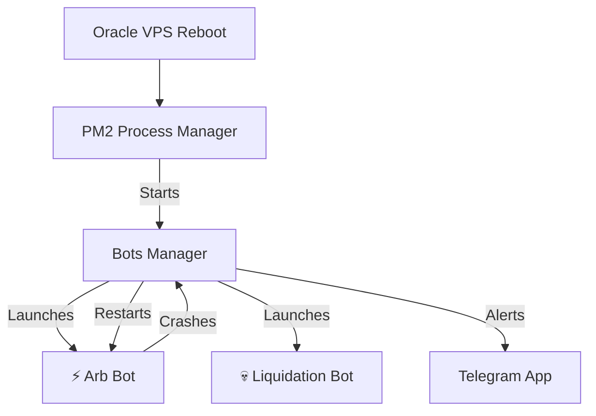

# 🤖 Bots Manager

Telegram-controlled process supervisor. Start, stop, restart, and monitor all your crypto bots from your phone.

## Quick Start

### 0. Install Dependencies

**Ubuntu / Debian:**
```bash
sudo apt update
sudo apt install -y git curl
curl -fsSL https://deb.nodesource.com/setup_18.x | sudo -E bash -
sudo apt install -y nodejs
```

**macOS:**
```bash
brew install git node
```

**Windows:**
1. Download and install Git: https://git-scm.com/download/win
2. Download and install Node.js 18+: https://nodejs.org

### 1. Clone & Install

```bash
git clone https://github.com/gitDivine/bots-manager.git
cd bots-manager
npm install
```

### 2. Configure

```bash
cp .env.example .env
```

Open `.env` in a text editor and fill in your values:

```bash
# Linux / Mac
nano .env

# Windows
notepad .env
```

Fill in these fields, then save and close (`Ctrl+O` → `Enter` → `Ctrl+X` in nano):

| Variable | Where to get it |
|---|---|
| `TELEGRAM_BOT_TOKEN` | Message @BotFather on Telegram → `/newbot` |
| `TELEGRAM_CHAT_ID` | Message @userinfobot on Telegram |
| `RPC_URL` | [Alchemy](https://alchemy.com) → Base Mainnet HTTP URL |
| `PRIVATE_KEY` | MetaMask → Export Private Key |

### 3. Configure Your Bots

You need to tell the manager where your bots are located.

1. **Find your bot paths:**
   Go into each bot folder and type `pwd` to see the full path:
   ```bash
   cd ~/base-arb-bot
   pwd
   # Example output: /home/ubuntu/base-arb-bot
   ```

2. **Edit the config file:**
   ```bash
   # Linux / Mac
   nano bots.config.js

   # Windows
   notepad bots.config.js
   ```

3. **Update the `dir` values** with the paths you found in step 1:

```js
const BOTS = {
  arb: {
    name: '⚡ Arb Bot',
    dir: '/home/ubuntu/base-arb-bot',    // ← Change to your path
    cmd: 'npm start',
    logFile: 'arb.log',
  },
  liquidation: {
    name: '💀 Liquidation Bot',
    dir: '/home/ubuntu/aave-liquidation-bot',  // ← Change to your path
    cmd: 'npm start',
    logFile: 'liquidation.log',
  },
};
```
Save and close (`Ctrl+O` → `Enter` → `Ctrl+X` in nano).

### 4. Run

```bash
npm start
```

The manager starts, auto-launches all configured bots, and begins listening for your Telegram commands.

## Telegram Commands

| Command | Description |
|---|---|
| `/status` | Show all bots status |
| `/status <bot>` | Show specific bot status |
| `/start <bot>` | Start a bot |
| `/stop <bot>` | Stop a bot |
| `/restart <bot>` | Restart a bot |
| `/startall` | Start all bots |
| `/stopall` | Stop all bots |
| `/restartall` | Restart all bots |
| `/logs <bot>` | Show last 15 log lines |
| `/wallet` | Check ETH balance |
| `/withdraw <bot> <token>` | Withdraw profits from bot contract |
| `/help` | Show all commands |

**Bot IDs** are the keys in `bots.config.js` (e.g., `arb`, `liquidation`).

## Adding a New Bot

Just add a new entry to `bots.config.js`:

```js
mybot: {
  name: '🚀 My New Bot',
  dir: '/home/ubuntu/my-new-bot',
  cmd: 'npm start',
  logFile: 'mybot.log',
  contractAddress: '',
  contractABI: [],
},
```

Restart the manager and the new bot is immediately controllable via Telegram.

## Running 24/7 on a VPS (Immortal Guardian) 🛡️

To ensure your bots stay online even if you log out or the server reboots, we use **Systemd** as the OS-level supervisor.

> [!IMPORTANT]
> **You only need to run the Manager via Systemd.** The manager acts as the "Guardian" for your individual bots, launching them automatically on startup and restarting them if they ever crash.

### 1. Configure the Service
Ensure your `bots.config.js` uses absolute Linux paths (e.g., `/home/ubuntu/...`).

### 2. Install the Service Unit
We provide a pre-configured service unit in the `systemd/` folder.
```bash
sudo cp systemd/bots-manager.service /etc/systemd/system/
```

### 3. Activate Persistence
```bash
sudo systemctl daemon-reload
sudo systemctl enable bots-manager
sudo systemctl start bots-manager
```

### 4. Monitor Everything
- `sudo systemctl status bots-manager` — Check if the Guardian is alive
- `journalctl -u bots-manager -f` — See live logs from all your bots in one stream
- `sudo systemctl restart bots-manager` — Restart the manager + all bots

## Self-Healing Architecture

The system is designed to be zero-maintenance:

1. **PM2 watches the Manager**: If the manager process crashes or the VPS reboots, PM2 brings it back instantly.
2. **Manager watches the Bots**: The manager monitors every bot it starts. If a bot crashes, the manager sends you a Telegram alert and **automatically restarts it** after 10 seconds.
3. **Auto-Updates**: Both the manager and the bots check GitHub every 10-60 minutes. If you push new code, they pull it, install dependencies, and restart themselves with the latest version.


```
Your Phone (Telegram)
    ↕ commands + responses
Bots Manager (always running)
    ↕ spawns / kills / monitors
    ├── Arb Bot process
    ├── Liquidation Bot process
    └── Any future bot process
```

The manager is a lightweight Node.js process that:
- Listens for Telegram commands via long-polling
- Spawns bot processes as child processes
- Pipes bot output to log files
- Sends you alerts if a bot crashes
- Sends hourly heartbeat status
- Auto-starts all bots on launch

## License

MIT
